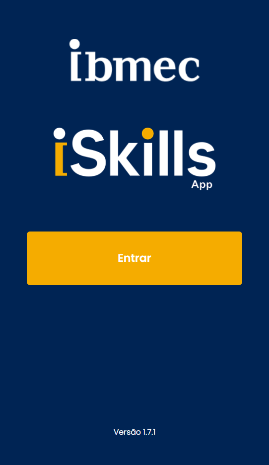

---
hide:
  - navigation
  - toc
---  

# PBE_25.2_8001

-   :material-github:{ .lg .middle } __ISkills - Não dei de avaliar__

    ---

   
      
  

-    :material-github:{ .lg .middle } __PBE_25.2_8001_I__
 
    ---

    Bernardo, Davi, Viniius, Felipe, Luiz Fabiano

    [:octicons-arrow-right-24: Repositório](https://github.com/Projetos-de-Extensao/PBE_25.2_8001_I)

-    :material-github:{ .lg .middle } __PBE_25.2_8001_II__     

    ---

    Bruno, Cauan, João Pedro, Guilherme Viana, Diogo

    [:octicons-arrow-right-24: Repositório](https://github.com/Projetos-de-Extensao/PBE_25.2_8001_II)

-   :material-github:{ .lg .middle } __PBE_25.2_8002_III__

    ---

    Vitor, Guilherme Reis, Mateus Reis, Pietro

    [:octicons-arrow-right-24: Repositório](https://github.com/Projetos-de-Extensao/PBE_25.2_8001_III)

-   :material-github:{ .lg .middle } __PBE_25.2_8002_IV__

    ---

    Anderson, Bernardo, Gabriel, João Pedro

    [:octicons-arrow-right-24: Repositório](https://github.com/Projetos-de-Extensao/PBE_25.2_8001_IV)

